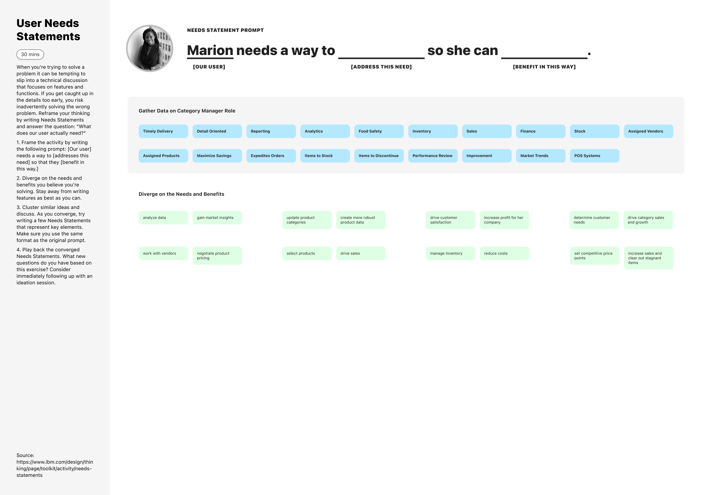
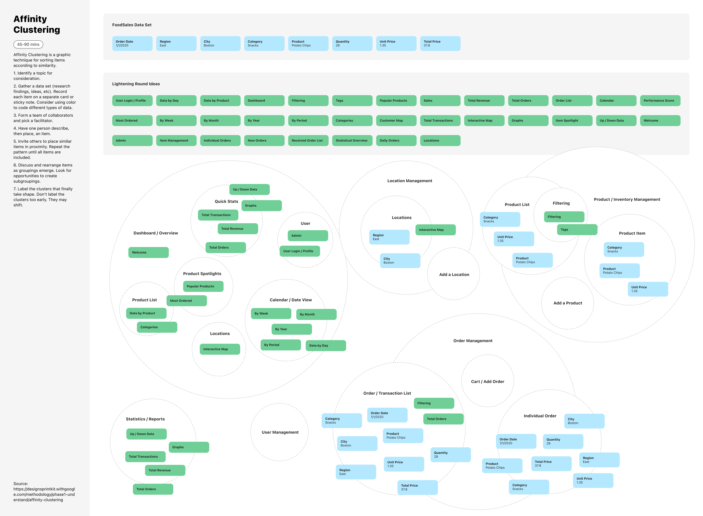
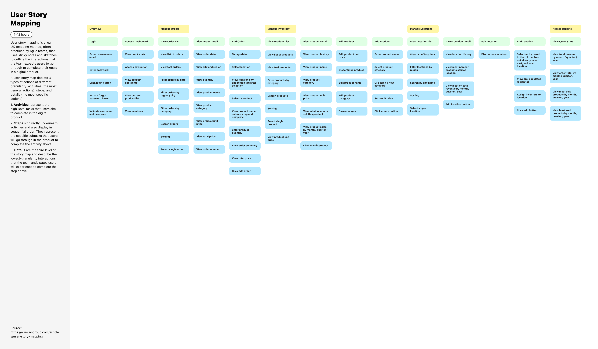
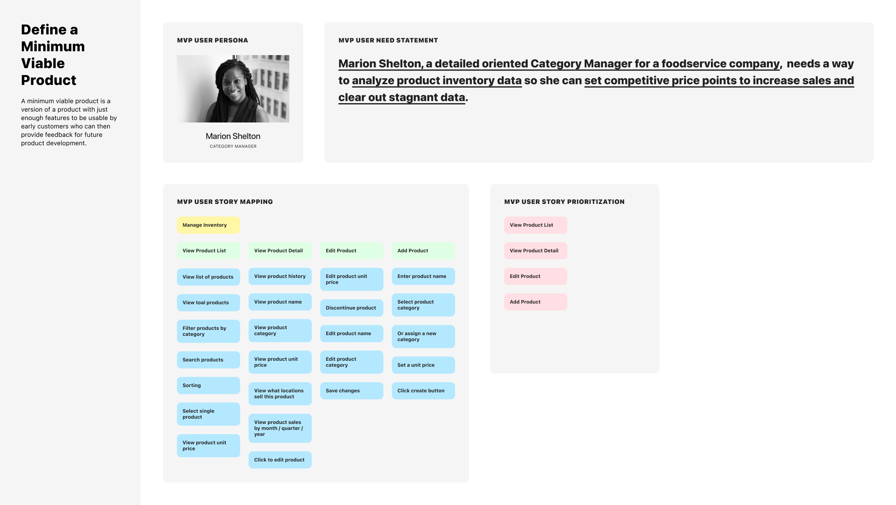

# FoodSales Tech Challenge

Welcome to the entry point for the FoodSales application code base and documentation.

The FoodSales tech challenge is an open-ended project to put together a framework to explore food sales data for a potential user who is looking to gain insights into the given dataset.

## Discovery and Inception

User Persona Creation

User Needs Statements

Affinity Clustering

User Story Mapping

Define a Minimum Viable Product

## Ideation and Creation

* Solution Sketching
* Journey Mapping
* Wireframing
* Style Tile Creation
* High Fidelities
* UI Design System
* UI Development

## Validation

* Usability Testing

## Further Resources

### [Digital Services Playbook](https://playbook.cio.gov/)

### [18F Methods](https://methods.18f.gov/)

### [IDEO Design Kit](https://www.designkit.org/)

### [Google Design Sprint Kit](https://designsprintkit.withgoogle.com/)

### [IBM Design Thinking](https://www.ibm.com/design/thinking/)
